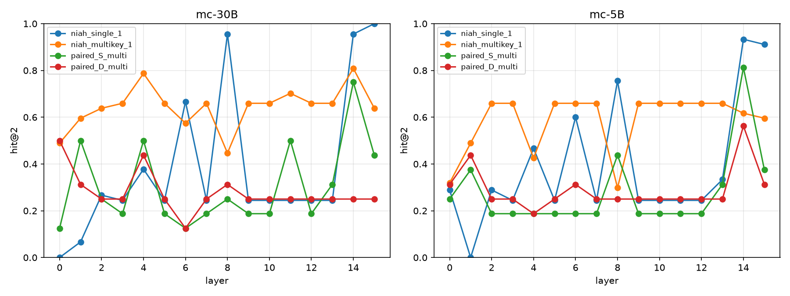
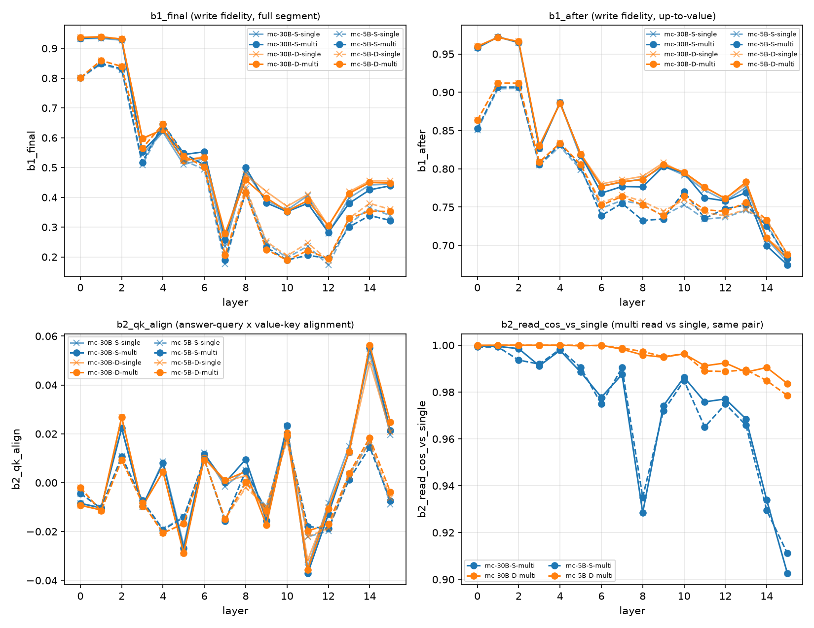
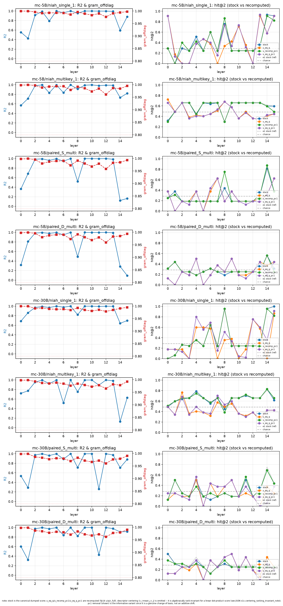
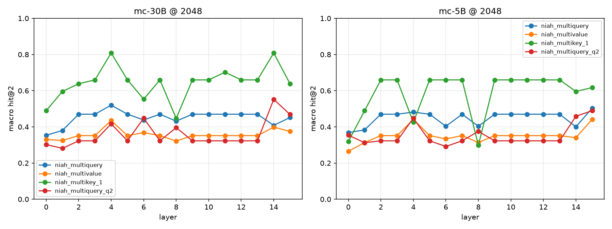

# MC-SSC GDN2 장문 기억 실패 분석 및 SRLA 후속 설계

## 0024–0026 종합 보고서

작성일: 2026-07-30  
대상 실험: 0024, 0025, 0026  
주 코드 브랜치: `sh/mc-niah-analysis`

---

## 초록

Memory-Caching SSC(mean-pool)를 적용한 GDN2 계열 모델이 multi-NIAH에서 실패하는 원인을 0024와 0025에서 단계적으로 분해했다. 0024는 state에 정보가 제대로 기록되는지, state에서 정보를 읽을 수 있는지, 올바른 과거 chunk를 선택하는지, 그리고 최종 생성에서 실패하는지를 분리했다. 그 결과 **write는 대체로 정상이고, 주된 병목은 routing**이었다. 특히 여러 key가 서로 다른 segment에 있을 때 router는 정답 key가 있는 segment를 찾는 것과 여러 후보 중 질의된 key를 선택하는 것을 충분히 수행하지 못했다.

0025는 이 현상을 더 세밀하게 검증했다. descriptor만으로 routing score가 재현되는 중간 layer 구간이 발견되었고, descriptor의 극단적인 anisotropy도 확인되었다. 그러나 `u_t := q_t` 변경, centering, PC1 제거 같은 저비용 보정은 문제를 해결하지 못했다. 더 결정적으로, key를 판별할 필요가 없는 multivalue task에서도 router가 “needle 검출은 완벽하다”는 기준선보다 약 4 SE 낮았다. 따라서 문제는 단순한 key 간 판별이 아니라 **descriptor가 query와 state의 관련성을 충분히 표현하지 못하는 문제**로 재정의되었다.

0025의 X4 random-routing ablation은 MC의 single-needle 장문 이득이 segment 분할 효과만으로 설명되지 않고 **학습된 routing 품질에 의존한다**는 점을 확인했다. 이에 따라 0026에서는 정답 chunk supervision과 state retrieval을 직접 학습하는 SRLA(State-Retrieved Linear Attention) 파일럿을 설계·구현했다. 0026은 현재 코드와 테스트가 준비된 단계이며, 실제 GPU 학습 결과는 아직 없다. 다음 차단 단계는 backward gate다.

핵심 결론은 다음과 같다.

> **MC 모델의 장문 single-needle 성능에는 실제 routing이 기여한다. 그러나 기존 mean-pool descriptor는 multi-key 및 장문 조건에서 충분한 판별 정보를 제공하지 못한다. 다음 실험은 단순 후처리 보정이 아니라, 정답 chunk supervision과 GDN2의 실제 read geometry를 반영한 descriptor 학습이어야 한다.**

---

## 1. 연구 질문과 공통 실험 설정

### 1.1 연구 질문

이 라운드의 질문은 다음 순서로 좁혀졌다.

1. MC-GDN2가 multi-NIAH에서 실패하는 원인은 write, read, routing, generation 중 어디인가?
2. routing 실패가 “key가 있는 segment를 찾지 못하는 문제”인지, “여러 key 중 질의된 key를 고르지 못하는 문제”인지 구분할 수 있는가?
3. 기존 MC의 장문 single-needle 이득은 routing 때문인가, 아니면 chunk별 write 부담 상한이라는 구조적 효과 때문인가?
4. 문제를 해결하기 위해 어떤 학습 가능한 retrieval 구조를 실험해야 하는가?

### 1.2 공통 모델 및 커널 설정

- 모델 계열: MC-GDN2 5B / 30B checkpoint
- 16 layers
- `topk=2`
- `chunk=256`
- descriptor: L2-normalized key mean-pool
- long-gdn worktree: `e71713e`
- 호환 kernel/fla pin: `4b02d15d`
- 0024·0025 추론 실험: VESSL A100
- 데이터: RULER NIAH 및 paired S/D 데이터

0024와 0025의 작은 표본 조건에서는 절대값보다 방향성을 우선 해석했다. paired S/D는 조건당 16쌍이고, 주요 NIAH 셀은 대체로 40–50개의 유효 샘플이다. bf16 재실행 노이즈는 약 2.3pp로 기록되었다.

---

## 2. 0024 — 실패 단계 분해: routing이 지배적 병목

### 2.1 실험 설계

0024는 실패를 다음 네 단계로 분해했다.

`write → read → route → generation`

- **E1 routing accuracy**: router가 gold chunk를 top-2 안에 넣는가?
- **E2 oracle routing injection**: gold chunk를 강제로 top-2에 넣었을 때 성능이 회복되는가?
- **E3 write/read fidelity**: state에 값이 기록되고, answer 위치에서 다시 읽히는가?

paired 데이터는 두 조건으로 구성했다.

- **S**: gold와 distractor가 같은 segment에 있음
- **D**: gold와 distractor가 서로 다른 segment에 있음

S는 segment-level routing만으로는 해결할 수 없는 within-segment read 충돌을 포함하고, D는 cross-segment routing 능력을 더 직접적으로 측정한다.

### 2.2 E1: routing 정확도

| best-layer hit@2 | single_1 | multikey_1 | paired-S | paired-D |
|---|---:|---:|---:|---:|
| mc-5B | 0.933 | 0.660 | 0.812 | 0.562 |
| mc-30B | 1.000 | 0.809 | 0.750 | 0.500 |

single task에서는 routing이 사실상 잘 작동했다. 그러나 paired-D에서는 mc-5B 0.562, mc-30B 0.500으로 낮았고, among-key 선택은 동전 던지기 수준이었다. 즉 router는 “어떤 segment에 needle이 있을 가능성이 있는가”는 어느 정도 포착하지만, **여러 key 중 질의된 key가 있는 segment를 고르는 능력은 부족**했다.



*그림 1. 0024 E1의 layer별 routing 정확도. best layer만 보면 single task와 multi-key/paired task 사이의 차이가 가려질 수 있으므로 layer profile과 함께 해석해야 한다.*

### 2.3 E2: oracle routing 개입

gold segment를 top-k에 강제 주입한 결과는 다음과 같다.

| model | paired-S baseline → oracle | paired-D baseline → oracle |
|---|---:|---:|
| mc-5B | 0.125 → 0.312 | 0.188 → 0.500 |
| mc-30B | 0.000 → 0.312 | 0.062 → 0.562 |

4/4 셀에서 oracle routing이 성능을 올렸다. 특히 paired-D에서 mc-30B는 +0.500으로 가장 큰 회복을 보였다. 이는 routing을 바꾸는 것만으로도 실패의 큰 부분이 회복된다는 **인과적 증거**다.

다만 oracle 결과가 1.0에 도달하지 않았으므로 routing 외에도 read-side interference, gate, generation 단계의 잔여 실패가 존재한다.

### 2.4 E3: write/read fidelity

- `b1_after`: value 직후 write fidelity는 대체로 0.67–0.97로 양호했다.
- single/multi 간 write 차이는 0.021 이하로 작았다.
- segment 끝까지 진행하면서 write가 누적되어 `b1_final`은 감소했다.
- paired-S에서는 answer 위치의 read cosine이 layer 깊이에 따라 약 0.91까지 하락했다.
- paired-D에서는 read cosine이 전 layer에서 대체로 0.98 이상이었다.



*그림 2. 0024 E3의 layer별 write/read fidelity. write 자체는 multi-NIAH 붕괴를 설명하지 못하지만, 같은 segment 안에 key가 충돌하는 S 조건에서는 read-side 문제가 추가된다.*

### 2.5 0024의 결론

0024의 최종 판정은 다음과 같다.

| 단계 | 판정 | 해석 |
|---|---|---|
| write | 대체로 정상 | 정보가 state에 기록되지 않는 것이 주원인은 아님 |
| read | 부분 실패 | 같은 segment에 key가 충돌하는 S 조건에서 read-side 간섭 발생 |
| route | 주요 실패 | D 조건에서 질의된 key의 segment 선택 실패 |
| oracle recovery | 모든 셀에서 개선 | routing이 인과적으로 중요한 병목임 |

따라서 0024는 다음 두 개선 방향을 제시했다.

1. **Cross-segment key 선택**: mean-pool만으로 key 정체성을 뭉개지 않는 descriptor 또는 query-conditioned scoring
2. **Within-segment 충돌 처리**: segment 내부에서 query-conditioned read 또는 per-key slot

---

## 3. 0025 — router 진단: descriptor 전반의 문제

0025는 0024의 routing 병목을 “router가 무엇을 알고 있으며 무엇을 모르는가”라는 관점에서 진단했다.

### 3.1 X1a: descriptor-only 예측

router score를 query 없이 다음 descriptor 특징만으로 예측했다.

- segment 위치 `pos`
- descriptor norm
- 평균 방향에서의 outlier 정도

layer 2·3·5·7·9·10·12·13에서는 8개 셀 모두 R² ≥ 0.9였고, 대부분 0.99 이상이었다. 특히 layer 2–13에서 `pos` 단독 R² 중앙값은 0.985였다. top-2 선택 집합도 96개 layer/cell 중 62개에서 Jaccard 1.0으로 재현되었다.

반면 실제 stock hit@2가 최고인 layer는 8개 셀 중 6개에서 layer 14–15였다. 즉 중간 layer는 위치 함수에 가깝지만, 실제 성능에 중요한 마지막 layer는 상대적으로 query 의존적인 정보를 포함한다.



*그림 3. 0025 X1의 descriptor-only 예측 및 layer별 routing 진단.*

판정은 다음과 같다.

- 전역적으로 query를 전혀 쓰지 않는다는 주장은 기각
- 그러나 layer 2–13에는 국소적인 query-blind/position-dominated 구간이 존재
- 0024에서 관찰된 layer 9–13의 평탄한 routing profile을 설명

### 3.2 X1b: `u_t := q_t` 변경

router query를 기존 `u_t` 대신 retrieval query `q_t`로 바꾸어 재계산했다.

핵심 paired-D 결과:

| model | stock | `u:=q` |
|---|---:|---:|
| mc-5B | 0.563 | 0.500 |
| mc-30B | 0.500 | 0.500 |

paired-S에서는 두 모델 모두 −18.75pp가 발생했다. 따라서 “read에 사용하는 `q`가 key identity를 갖고 있으므로 router query로 사용하면 해결된다”는 저비용 처방은 기각되었다.

해석상 중요한 점은 query 정보가 전혀 없다는 것이 아니라, **query 정보가 현재 mean-pool descriptor와의 내적에서 유용한 형태로 꺼내지지 않는다**는 것이다.

### 3.3 X1c: anisotropy와 저비용 보정

descriptor Gram off-diagonal 평균은 8개 셀 × 16 layer 전부에서 0.958–0.9998이었다. descriptor들이 거의 같은 방향을 공유하는 극단적 anisotropy다.

그러나 보정은 실패했다.

- centering: 모든 segment score에 같은 상수를 더하는 대수적 no-op
- PC1 제거: paired-D에서 mc-5B는 변화 없음, mc-30B는 0.500 → 0.375로 악화

따라서 anisotropy는 실재하지만, 지배 방향을 제거하면 숨은 key 판별 신호가 드러나는 구조는 아니었다. 문제는 “정보가 가려져 있음”보다는 **descriptor에 필요한 정보가 충분히 들어 있지 않음**에 가깝다.

### 3.4 X2: multi-query와 multivalue 기준선

0025의 결정적 실험은 router가 단순히 “needle이 있는 segment를 찾는 능력”은 이미 완벽하다고 가정하는 것이 맞는지 검증한 것이다.

- `multiquery`: 여러 needle을 모두 질의
- `multivalue`: key는 하나이고 value만 여러 개이므로 key 간 판별이 필요 없음
- `needle-null`: needle이 있는 segment를 안다고 가정하고 그 안에서 균등하게 top-k를 고르는 기준선

2048에서의 핵심 결과:

| task | model | 관측 hit@2 | needle-null |
|---|---|---:|---:|
| multiquery | mc-5B | 0.503 | 0.750 |
| multiquery | mc-30B | 0.520 | 0.750 |
| multivalue | mc-5B | 0.442 | 0.723 |
| multivalue | mc-30B | 0.435 | 0.723 |

multivalue는 key 판별이 필요 없는 task인데도 needle-null보다 약 4 SE 낮았다. 따라서 상위 주장 “router는 needle 검출은 완벽하고 key 판별만 못 한다”는 기각된다. 더 정확한 진단은 다음과 같다.

> router는 multi-key 판별 이전 단계인 **needle/descriptor 매칭 자체에서 이미 실패**한다.

길이 확장에서도 문제가 커졌다. 예를 들어 mc-30B `multikey_1`의 skill은 2048에서 0.63, 4096에서 0.15, 8192에서 0.01로 감소했다.



*그림 4. 0025 X2의 2048-token layer별 routing 결과. 원시 hit@2보다 chance와 structural ceiling을 함께 고려한 skill 해석이 필요하다.*

### 3.5 X4: random-routing ablation

X4는 MC의 장문 single-needle 이득이 실제 routing 때문인지 검증했다.

설정:

- 모델: mc-5B, mc-30B
- task: `niah_single_1`, `niah_multikey_1`
- 길이: 1K–32K
- stock / recent / random routing
- random seed 0–4
- `n_gen=128`, `chunk=256`, `topk=2`, 셀당 n=50

| model / task | 1K | 2K | 4K | 8K | 16K | 32K |
|---|---:|---:|---:|---:|---:|---:|
| mc-5B single — stock | 84 | 66 | 68 | 70 | 76 | 58 |
| mc-5B single — random mean | 4.8 | 0.8 | 1.6 | 0.4 | 0 | 0 |
| mc-30B single — stock | 4 | 16 | 24 | 16 | 16 | 18 |
| mc-30B single — random mean | 0.4 | 0 | 0 | 0 | 0 | 0 |
| mc-5B multikey — stock | 20 | 24 | 12 | 2 | 0 | 0 |
| mc-5B multikey — random mean | 12.4 | 1.6 | 0.8 | 0 | 0 | 0 |
| mc-30B multikey — stock | 2 | 20 | 2 | 2 | 0 | 0 |
| mc-30B multikey — random mean | 1.6 | 3.2 | 0.4 | 0 | 0 | 0 |

`recent`도 stock보다 낮았다. random seed 간 변동은 대체로 0–2%p였다.

32K에서 stock과 random의 차이가 명확하다.

- mc-5B single: 58% vs 0%
- mc-30B single: 18% vs 0%

따라서 MC의 single-needle 장문 이득은 write 부담 상한만으로 설명되지 않으며, **학습된 routing이 실제 성능에 기여**한다. 반대로 multikey는 stock routing도 장문에서 무너지므로, 이 task에는 descriptor/supervision 병목이 여전히 남아 있다.

X4 원본 표는 [x4_table.md](../lmr/analysis/260725_mc_niah_analysis/results/x4_table.md)에서 확인할 수 있다.

### 3.6 0025의 통합 판정

| 질문 | 판정 |
|---|---|
| 중간 layer routing은 query를 사용하는가? | 국소적으로는 거의 위치 함수지만, 전체적으로 query 정보는 존재 |
| `u:=q`가 해결책인가? | 기각 |
| anisotropy가 핵심 원인인가? | 극단적 anisotropy는 확정되지만 단순 보정은 무효 |
| router는 needle 검출만 못 하는가? | 기각. multivalue도 실패 |
| MC 장문 single 이득은 routing 때문인가? | X4에서 확정적으로 지지 |
| H_outlier/H_template | 직접 실험하지 않아 보류 |

0025는 X3/X5를 실행하지 않았다. 두 실험은 “needle 검출 자체는 정상”이라는 상위 가설에 의존하는데, X2가 그 가설을 기각했기 때문이다.

---

## 4. 0026 — SRLA 후속 실험 설계와 구현 상태

0026은 0024·0025의 실측 결과를 바탕으로 설계한 State-Retrieved Linear Attention 파일럿이다. 중요한 점은 **0026에는 아직 학습 결과나 성능 수치가 없다**는 것이다. 현재는 구현, 테스트, 사전 probe, backward gate 준비 단계다.

### 4.1 핵심 아이디어

긴 텍스트를 그대로 이어 붙이는 대신, 과거 chunk의 GDN2 recurrent state를 저장하고 현재 token의 query로 필요한 state를 검색해 fusion한다.

0026 rev2의 핵심 정의는 다음과 같다.

- 전체 context 길이 `L_c=2048`은 chunk 크기가 아니다.
- 실제 chunk 크기 `L_chunk=256`이며, 2048 context에는 8개 chunk가 있다.
- descriptor는 chunk 단위 mean key로 만든다.
- query는 chunk 평균이 아니라 **각 입력 token별로 계산**한다.
- token t는 자신보다 앞선 완료 chunk만 선택할 수 있다.

개념적으로:

```text
D_m = W_desc(mean(k in chunk m))
q_t = W_q(q_proj_t)
K_t = top-k previous chunks by cosine(q_t, D_m)
S_fused(t) = S_current(t) + Σ α(t,m) Φ_align(S_m)
```

### 4.2 구현된 구성

0026 worktree에는 다음 구성요소가 준비되어 있다.

- descriptor module
- router module
- state cache
- fusion wrapper
- toy backbone / backbone loader
- router training script
- SRLA evaluation script
- TTFT benchmark
- backward gate
- SLURM execution scripts

지정된 SRLA 테스트 묶음은 인수인계 기록 기준 `215 passed, 1 skipped`다.

### 4.3 학습 목표

backbone은 우선 freeze하고 다음 모듈을 학습한다.

- `W_desc`
- `W_q`
- `Φ_align`

손실은 두 종류를 조합할 수 있도록 설계했다.

- LM loss
- gold chunk를 직접 지정하는 supervised router loss

0024·0025 결과에 비추어 primary 후보는 router loss를 포함하는 설정이다. LM loss만으로는 top-k에 선택되지 않은 chunk에 충분한 gradient가 도달하지 않을 수 있기 때문이다.

### 4.4 CPU bilinear pre-check

GPU 학습 전, rank 제한 bilinear form이 기존 `M=I` 방식보다 나아질 가능성이 있는지 검사하는 CPU probe도 준비되어 있다.


*그림 5. 0026 CPU bilinear pre-check figure. 이 figure는 probe가 생성되었음을 보여주는 진단 산출물이며, 결과 JSON을 읽고 held-out 성능과 shuffled-query 대조군을 비교하기 전에는 긍정적인 학습 가능성 결론으로 사용하지 않는다.*

비교 대상은 다음과 같다.

- `M=I`
- stock scorer
- chance
- 위치 prior
- `shuffled_q` 대조군

현재 남은 작업은 `/data2/sohyung/mc_niah/results/probe_bilinear_router.json`의 summary를 읽고, 실제 query–descriptor 대응 신호가 held-out에서도 남는지 판정하는 것이다.

### 4.5 Backward gate

실제 SRLA 학습 전 다음을 확인해야 한다.

#### Gate A: router gradient

gold chunk CE가 `W_q`와 `W_desc`에 유한하고 0이 아닌 gradient를 전달하는지 확인한다.

#### Gate B: LM backward

LM loss가 `chunk_gdn2` backward를 통과하는지 확인한다. 로컬 GPU 환경은 forward/eval이 검증되었지만, 해당 kernel의 학습 backward는 별도 확인이 필요하다.

Gate B가 실패하면 `--no-lm-loss --detach-bank` 축소 설정을 검토해야 한다. 이 경우 LM-loss 단계와 일부 hybrid arm은 A100/H200급 환경에서 다시 검증해야 한다.

### 4.6 0026의 현재 판정

| 항목 | 현재 상태 |
|---|---|
| SRLA 설계 | 완료, rev2 기준 |
| 코드 구현 | 완료 |
| 지정 테스트 | 215 passed, 1 skipped 기록 |
| CPU bilinear probe | 산출물 생성, 결과 해석 필요 |
| backward gate | 결과 확인 필요 |
| primary GPU 학습 | 아직 실행하지 않음 |
| 성능 개선 결론 | 아직 없음 |

따라서 0026은 “성능이 개선되었다”는 결과 보고서가 아니라, 0025에서 확인한 병목을 학습 가능한 구조로 검증하기 위한 **후속 실험 플랫폼**이다.

---

## 5. 0024–0026을 합친 인과적 해석

현재까지의 증거를 흐름으로 정리하면 다음과 같다.

```text
GDN2 state write
      │
      ├─ 대체로 정상 (0024 E3)
      │
state read
      ├─ D: 대체로 보존
      └─ S: within-segment 충돌에서 부분 실패
      │
segment routing
      ├─ single: 강함
      ├─ multi-key: 불안정
      ├─ multiquery/multivalue: needle-null보다 낮음
      └─ 장문에서 급격히 약화
      │
long-context generation
      ├─ stock routing: single-needle 장문 이득
      └─ random routing: 이득 소멸
```

이 흐름은 다음 세 가지를 동시에 지지한다.

1. **write가 주범은 아니다.** state 안에 정보가 기록되는 것 자체는 충분히 작동한다.
2. **routing은 실제 성능 레버다.** oracle 개입과 X4 random ablation이 각각 인과적·행동적 증거를 제공한다.
3. **기존 descriptor 표현이 부족하다.** multivalue 실패와 저비용 보정 실패는 문제를 단순한 key-vs-key 판별로 축소할 수 없게 만든다.

따라서 0026의 학습 목표는 단순히 router query를 바꾸는 것이 아니라, 정답 chunk supervision을 통해 query와 state descriptor가 실제 read relevance를 표현하도록 만드는 것이다.

---

## 6. 최종 결론과 연구 방향

### 6.1 확정된 결론

- 0024: MC-GDN2 multi-NIAH 실패의 지배적 병목은 routing이다.
- 0024: write는 대체로 정상이며, S 조건에는 별도의 read-side 충돌이 있다.
- 0025: 중간 layer routing은 위치 함수에 가깝고, descriptor anisotropy는 극단적이다.
- 0025: `u:=q`, centering, PC1 제거는 해결책이 아니다.
- 0025: multivalue에서도 needle-null 기준선을 이기지 못하므로 문제는 descriptor 전반이다.
- 0025: MC single-needle 장문 이득은 random routing으로 사라지므로 학습된 routing에 의존한다.

### 6.2 아직 확정되지 않은 것

- 학습된 bilinear form이 held-out에서 유효한지
- supervised router loss만으로 충분한지
- GDN2의 실제 WY/UT read geometry에 맞춘 descriptor가 개선되는지
- within-segment S 충돌을 SRLA가 해결할 수 있는지
- 0026의 LM backward가 현재 로컬 GPU/kernel 환경에서 가능한지

### 6.3 권장 실행 순서

1. CPU bilinear probe JSON 결과를 held-out 및 `shuffled_q` 기준으로 해석
2. SLURM backward gate 실행
3. `fla` pin, kernel marker, import 경로 확인
4. Gate A/B 결과 보고
5. 승인 후 primary SRLA 학습 실행
6. `trained` 대 `untrained-identity`를 핵심 비교로 평가
7. context length 1K–16K에서 retrieval accuracy, full-window perplexity, TTFT를 함께 측정

---

## 7. 한계와 해석 주의사항

- paired S/D는 조건당 16쌍으로 작다. 한 sample flip이 6.25pp에 해당한다.
- best-layer 선택은 16개 layer 중 최댓값을 고르는 절차이므로 상향 편의가 있다.
- `single_1`은 noise-haystack, `single_2`는 essay-haystack이다. 둘을 직접 비교하면 안 된다.
- X2의 multiquery@2048은 structural ceiling 포화가 있어 비포화 subset을 함께 봐야 한다.
- X4의 vanilla anchor는 다른 protocol의 외부 참조이므로 직접적인 score 비교에 사용하지 않는다.
- H_outlier와 H_template은 X3를 실행하지 않았으므로 기각이 아니라 미검정이다.
- 0026은 아직 실제 학습 결과가 없다. 구현 완료와 성능 검증 완료를 혼동하면 안 된다.

---

## 8. 산출물 및 재현 문서

### 주요 보고서

- [0024 한국어 요약](0024_kr.md)
- [0024 영문 원문](0024.md)
- [0025 한국어 보고서](0025_ko.md)
- [0026 현재 상태 요약](0026_current_status_ko.md)
- [0026 SRLA 설계 사양](../docs/superpowers/specs/2026-07-28-0026-retrieval-improvement.md)
- [0026 인수인계 문서](../HANDOFF_TO_CODEX.md)

### 본문에 포함한 figure

| figure | 출처 | 역할 |
|---|---|---|
| 그림 1 | `report/0024_figs/e1_routing.png` | 0024 routing 정확도 |
| 그림 2 | `report/0024_figs/e3_fidelity.png` | 0024 write/read fidelity |
| 그림 3 | `lmr/analysis/260725_mc_niah_analysis/results/x1_router_probe.png` | 0025 descriptor-only 진단 |
| 그림 4 | `lmr/analysis/260725_mc_niah_analysis/results/x2_layers_2048.png` | 0025 layer별 multi-task 진단 |
| 그림 5 | `lmr/analysis/260725_mc_niah_analysis/results/probe_bilinear_router.png` | 0026 CPU pre-check |

### 추가 결과

- 0025 X4 표: `lmr/analysis/260725_mc_niah_analysis/results/x4_table.md`
- 0025 분석 결과 JSON: `lmr/analysis/260725_mc_niah_analysis/results/`
- 0026 bilinear probe JSON: `/data2/sohyung/mc_niah/results/probe_bilinear_router.json`

